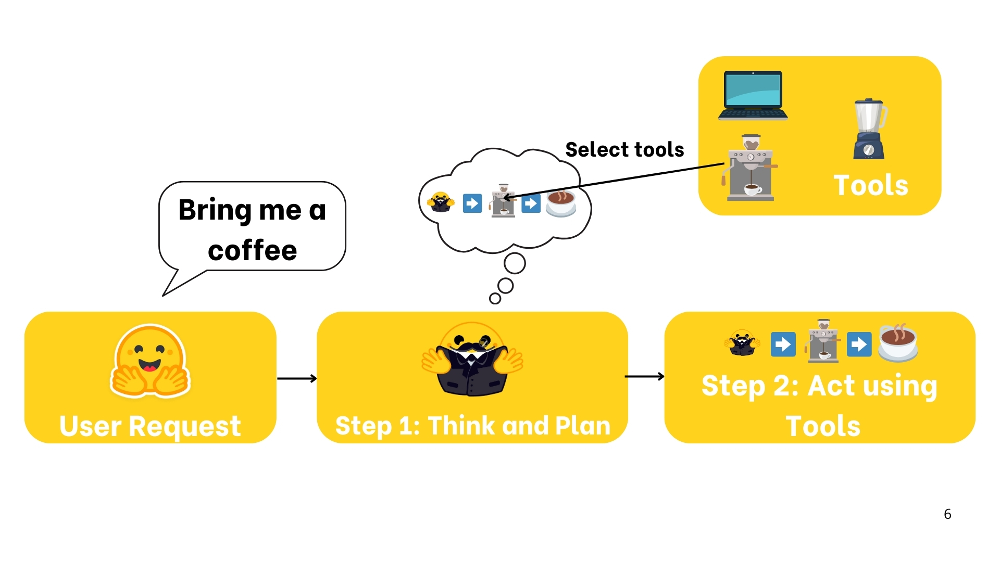

# Unit1 - INTRO to Agent



[https://huggingface.co/learn/agents-course/unit1/what-are-agents](https://huggingface.co/learn/agents-course/unit1/what-are-agents)

> Agent is: an **AI model capable of reasoning, planning, and interacting with its environment**.
> 

---


---

---

# what type of tasks can an Agent

### **Example 1: Personal Virtual Assistants**

Virtual assistants like Siri, Alexa, or Google Assistant, work as agents when they interact on behalf of users using their digital environments.

They take user queries, analyze context, retrieve information from databases, and provide responses or initiate actions (like setting reminders, sending messages, or controlling smart devices).

### **Example 2: Customer Service Chatbots**

Many companies deploy chatbots as agents that interact with customers in natural language.

These agents can answer questions, guide users through troubleshooting steps, open issues in internal databases, or even complete transactions.

Their predefined objectives might include improving user satisfaction, reducing wait times, or increasing sales conversion rates. By interacting directly with customers, learning from the dialogues, and adapting their responses over time, they demonstrate the core principles of an agent in action.

### **Example 3: AI Non-Playable Character in a video game**

AI agents powered by LLMs can make Non-Playable Characters (NPCs) more dynamic and unpredictable.

---

---

# **What is a Large Language Model?**

LLM is a type of AI model that excels at **understanding and generating human language**.

- Most LLMs nowadays are **built on the Transformer architecture**


- There are 3 types of transformers:
    1. **Encoders**
        
        An encoder-based Transformer takes text (or other data) as input and outputs a dense representation (**or embedding) of that text.**
        
        - **Example**: BERT from Google
        - **Use Cases**: Text classification, semantic search, Named Entity Recognition
        - **Typical Size**: Millions of parameters
    2. **Decoders**
        
        A decoder-based Transformer focuses **on generating new tokens to complete a sequence, one token at a time**.
        
        - **Example**: Llama from Meta
        - **Use Cases**: Text generation, chatbots, code generation
        - **Typical Size**: Billions (in the US sense, i.e., 10^9) of parameters
    3. **Seq2Seq (Encoder–Decoder)**
        
        A sequence-to-sequence Transformer *combines* an encoder and a decoder. The encoder first processes the input sequence into a context representation, then the decoder generates an output sequence.
        
        - **Example**: T5, BART
        - **Use Cases**: Translation, Summarization, Paraphrasing
        - **Typical Size**: Millions of parameters

The underlying principle of an LLM is simple yet highly effective: **its objective is to predict the next token, given a sequence of previous tokens**. 


---

---

# Messages and Special tokens


We see here the difference between what we see in UI and the prompt fed to the model.

## System messages (also called System Prompts)

- define **how the model should behave**. They serve as **persistent instructions**, guiding every subsequent interaction.


When using Agents, the System Message also **gives information about the available tools, provides instructions to the model on how to format the actions to take, and includes guidelines on how the thought process should be segmented.**

## Conversation :  User and Assistant

A conversation consists of alternating messages between a Human (user) and an LLM (assistant).

---

## Chat-Templates

Another point we need to understand is the difference between a Base Model vs. an Instruct Model:

- *A Base Model* is trained on raw text data to predict the next token.
    - To make a Base Model behave like an instruct model, we need to **format our prompts in a consistent way that the model can understand**. This is where chat templates come in.
- An *Instruct Model* is fine-tuned specifically to follow instructions and engage in conversations.

This structure **helps maintain consistency across interactions and ensures the model responds appropriately to different types of inputs**.


To convert the previous conversation into a prompt, we load the tokenizer and call `apply_chat_template`:

```python
from transformers import AutoTokenizer

tokenizer = AutoTokenizer.from_pretrained("HuggingFaceTB/SmolLM2-1.7B-Instruct")
rendered_prompt = tokenizer.apply_chat_template(messages, tokenize=False, add_generation_prompt=True)
```

> ***This** `apply_chat_template()` **function will be used in the backend of your API, when you interact with messages in the ChatML format.***
> 

---

---

# What are Tools?

Tools play a crucial role in enhancing the capabilities of AI agents.

- *What Tools Are*: Functions that give LLMs extra capabilities, such as performing calculations or accessing external data.
- *How to Define a Tool*: By providing a clear textual description, inputs, outputs, and a callable function.
- *Why Tools Are Essential*: They enable Agents to overcome the limitations of static model training, handle real-time tasks, and perform specialized actions.

---

---

# AI through Thought-Action-Observation cycle


1. **Thought**: The LLM part of the Agent decides what the next step should be.
2. **Action:** The agent takes an action, by calling the tools with the associated arguments.
3. **Observation:** The model reflects on the response from the tool.

- **Alfred, the weather Agent**


---

---

# Thought; Internal reasoning and the Re-Act Approach

| **Type of Thought** | **Example** |
| --- | --- |
| Planning | “I need to break this task into three steps: 1) gather data, 2) analyze trends, 3) generate report” |
| Analysis | “Based on the error message, the issue appears to be with the database connection parameters” |
| Decision Making | “Given the user’s budget constraints, I should recommend the mid-tier option” |
| Problem Solving | “To optimize this code, I should first profile it to identify bottlenecks” |
| Memory Integration | “The user mentioned their preference for Python earlier, so I’ll provide examples in Python” |
| Self-Reflection | “My last approach didn’t work well, I should try a different strategy” |
| Goal Setting | “To complete this task, I need to first establish the acceptance criteria” |
| Prioritization | “The security vulnerability should be addressed before adding new features” |


> Recent models like **Deepseek R1** or **OpenAI’s o1** were fine-tuned to *think before answering*. They use structured tokens like `<think>` and `</think>` to explicitly separate the reasoning phase from the final answer.
> 
> 
> Unlike ReAct or CoT — which are prompting strategies — this is a **training-level technique**, where the model learns to think via examples.
> 

---

---

# Actions; enabling the Agent to engage with its environment

| **Type of Action** | **Description** |
| --- | --- |
| Information Gathering | Performing web searches, querying databases, or retrieving documents. |
| Tool Usage | Making API calls, running calculations, and executing code. |
| Environment Interaction | Manipulating digital interfaces or controlling physical devices. |
| Communication | Engaging with users via chat or collaborating with other agents. |

---

---

# Observe; integrating feedback to reflect and adapt

In the observation phase, the agent:

- **Collects Feedback:** Receives data or confirmation that its action was successful (or not).
- **Appends Results:** Integrates the new information into its existing context, effectively updating its memory.
- **Adapts its Strategy:** Uses this updated context to refine subsequent thoughts and actions.

| **ype of Observation** | **Example** |
| --- | --- |
| System Feedback | Error messages, success notifications, status codes |
| Data Changes | Database updates, file system modifications, state changes |
| Environmental Data | Sensor readings, system metrics, resource usage |
| Response Analysis | API responses, query results, computation outputs |
| Time-based Events | Deadlines reached, scheduled tasks completed |

---

---